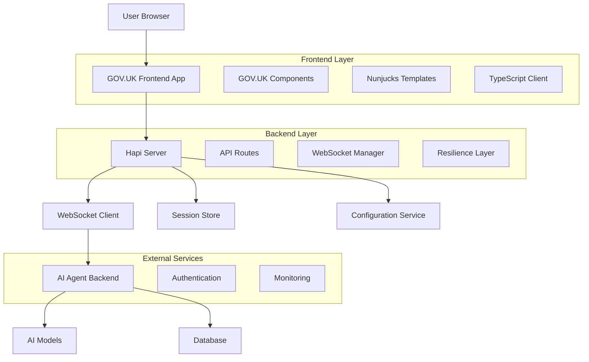
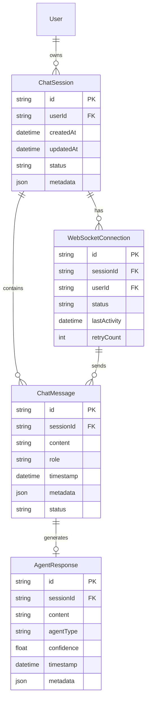
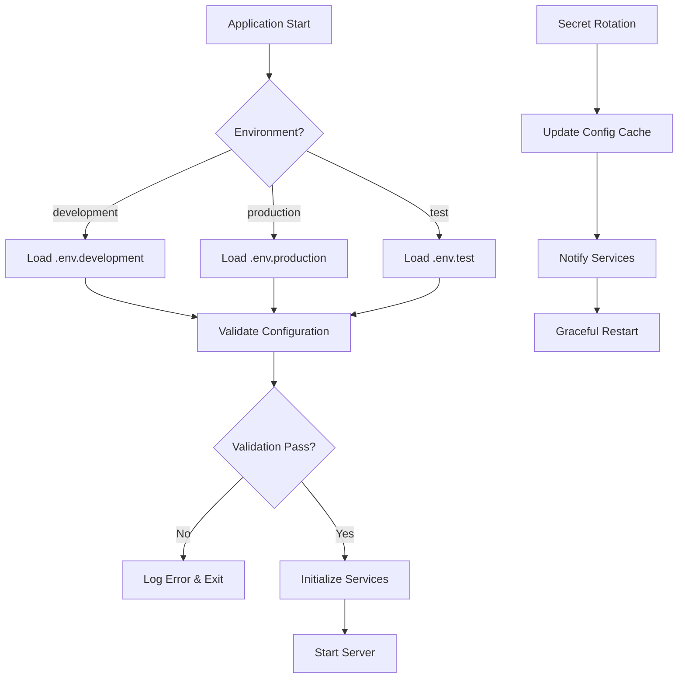
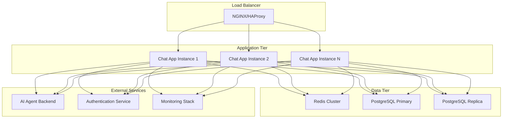
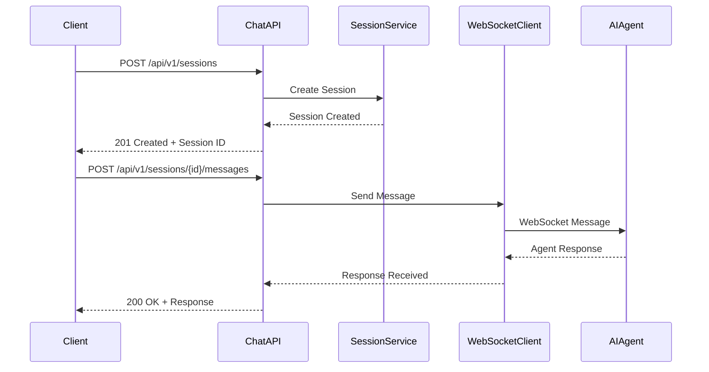
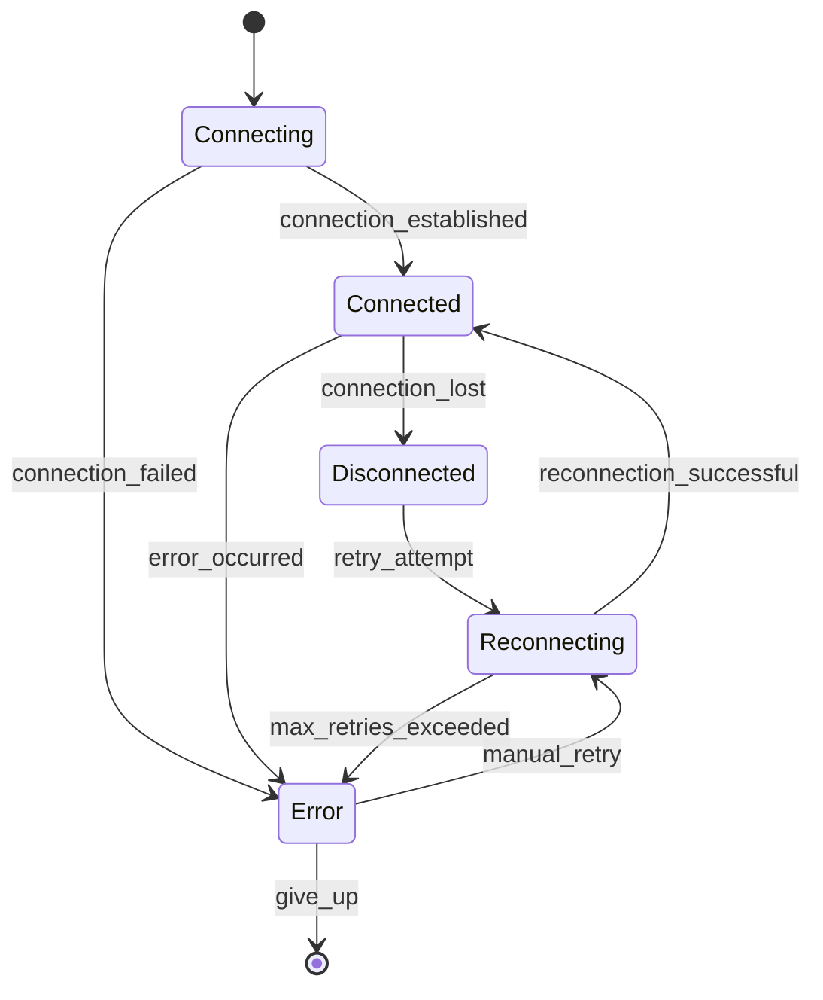
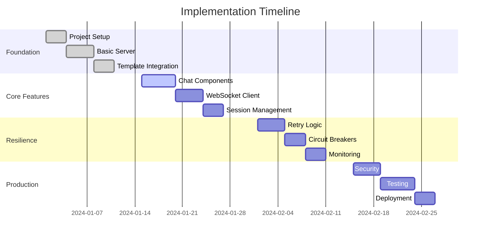

# GOV.UK Frontend Chat Interface - Architectural Plan

## Executive Summary

This architectural plan outlines the development of a **GOV.UK Frontend-based Chat Interface** that provides a government-compliant user interface for interacting with AI agent websocket endpoints. The system is designed to deliver insights into governance models through a real-time chat interface that adheres to the GOV.UK Design System standards.

### Key Architecture Decisions

1. **Technology Stack**: TypeScript + Node.js + Hapi + Nunjucks + GOV.UK Frontend
2. **Real-time Communication**: WebSocket connections to AI agent backend
3. **State Management**: Session-based conversation state with Redis/PostgreSQL persistence
4. **Resilience Strategy**: Circuit breakers, retry logic, and graceful degradation
5. **Deployment**: Cloud-native with Docker containerization

### High-Level Architecture



## Domain Model

### Core Entities

```typescript
// Core domain entities
interface ChatSession {
  id: string;
  userId: string;
  createdAt: Date;
  updatedAt: Date;
  status: 'active' | 'inactive' | 'archived';
  messages: ChatMessage[];
  metadata: SessionMetadata;
}

interface ChatMessage {
  id: string;
  sessionId: string;
  content: string;
  role: 'user' | 'assistant' | 'system';
  timestamp: Date;
  metadata: MessageMetadata;
  status: 'pending' | 'sent' | 'delivered' | 'failed';
}

interface WebSocketConnection {
  id: string;
  sessionId: string;
  userId: string;
  status: 'connecting' | 'connected' | 'disconnected' | 'error';
  lastActivity: Date;
  retryCount: number;
}

interface AgentResponse {
  id: string;
  sessionId: string;
  content: string;
  agentType: 'BankRep' | 'TradeBodyRep' | 'PaymentsEcosystemRep';
  confidence: number;
  timestamp: Date;
  metadata: AgentMetadata;
}
```

### Entity Relationship Diagram



## Project Structure

```
govuk-chat-frontend/
├── src/
│   ├── server/
│   │   ├── index.ts                 # Hapi server entry point
│   │   ├── plugins/
│   │   │   ├── websocket.ts        # WebSocket plugin
│   │   │   ├── auth.ts             # Authentication plugin
│   │   │   ├── resilience.ts       # Resilience patterns plugin
│   │   │   └── monitoring.ts       # Monitoring plugin
│   │   ├── routes/
│   │   │   ├── chat.ts             # Chat API routes
│   │   │   ├── sessions.ts         # Session management routes
│   │   │   └── health.ts           # Health check routes
│   │   ├── services/
│   │   │   ├── websocket-client.ts # WebSocket client service
│   │   │   ├── session-service.ts  # Session management
│   │   │   ├── resilience-service.ts # Circuit breakers, retries
│   │   │   └── config-service.ts   # Configuration management
│   │   ├── models/
│   │   │   ├── chat-session.ts     # Session domain model
│   │   │   ├── chat-message.ts     # Message domain model
│   │   │   └── websocket-connection.ts # Connection model
│   │   ├── utils/
│   │   │   ├── validation.ts       # Joi validation schemas
│   │   │   ├── encryption.ts       # Encryption utilities
│   │   │   └── logging.ts          # Structured logging
│   │   └── config/
│   │       ├── development.ts      # Development config
│   │       ├── production.ts       # Production config
│   │       └── test.ts             # Test config
│   ├── client/
│   │   ├── components/
│   │   │   ├── chat-window.ts      # Main chat interface
│   │   │   ├── message-list.ts     # Message display
│   │   │   ├── message-input.ts    # Message input
│   │   │   ├── connection-status.ts # Connection indicator
│   │   │   └── error-boundary.ts   # Error handling
│   │   ├── services/
│   │   │   ├── websocket-service.ts # WebSocket client
│   │   │   ├── api-service.ts      # REST API client
│   │   │   └── state-service.ts    # Client state management
│   │   ├── utils/
│   │   │   ├── govuk-helpers.ts    # GOV.UK component helpers
│   │   │   ├── validation.ts       # Client-side validation
│   │   │   └── formatting.ts       # Message formatting
│   │   └── types/
│   │       ├── chat.ts             # Chat-related types
│   │       ├── websocket.ts        # WebSocket types
│   │       └── api.ts              # API types
│   └── templates/
│       ├── layouts/
│       │   └── default.njk         # Default layout template
│       ├── pages/
│       │   ├── index.njk           # Home page
│       │   ├── chat.njk            # Chat interface
│       │   └── error.njk           # Error page
│       └── components/
│           ├── chat-message.njk    # Message component
│           ├── input-form.njk      # Input form component
│           └── status-indicator.njk # Status indicator
├── public/
│   ├── css/
│   │   └── application.css         # Custom styles
│   ├── js/
│   │   ├── application.js          # Main application JS
│   │   └── components/             # Component-specific JS
│   └── images/
│       └── govuk/                  # GOV.UK assets
├── tests/
│   ├── unit/
│   │   ├── services/               # Service unit tests
│   │   ├── models/                 # Model unit tests
│   │   └── utils/                  # Utility tests
│   ├── integration/
│   │   ├── api/                    # API integration tests
│   │   ├── websocket/              # WebSocket tests
│   │   └── resilience/             # Resilience tests
│   └── e2e/
│       ├── chat-flow.spec.ts       # End-to-end chat tests
│       └── error-scenarios.spec.ts # Error scenario tests
├── docker/
│   ├── Dockerfile                  # Multi-stage Dockerfile
│   ├── docker-compose.yml          # Development compose
│   └── docker-compose.prod.yml     # Production compose
├── docs/
│   ├── api/                        # API documentation
│   ├── deployment/                 # Deployment guides
│   └── development/                # Development guides
├── package.json
├── tsconfig.json
├── .eslintrc.js
├── .prettierrc
└── README.md
```

## Technology Stack

### Core Dependencies

```json
{
  "dependencies": {
    "@hapi/hapi": "^21.2.0",
    "@hapi/joi": "^17.12.0",
    "@hapi/inert": "^7.1.0",
    "@hapi/vision": "^7.0.0",
    "nunjucks": "^3.3.5",
    "govuk-frontend": "^5.11.2",
    "ws": "^8.18.0",
    "p-retry": "^6.2.0",
    "opossum": "^8.2.0",
    "redis": "^4.6.0",
    "pg": "^8.11.0",
    "dotenv": "^16.4.0",
    "winston": "^3.11.0",
    "helmet": "^7.1.0",
    "rate-limiter-flexible": "^4.0.0"
  },
  "devDependencies": {
    "@types/node": "^22.0.0",
    "@types/ws": "^8.5.0",
    "@types/nunjucks": "^3.2.0",
    "typescript": "^5.5.0",
    "ts-node": "^10.9.0",
    "nodemon": "^3.0.0",
    "jest": "^29.7.0",
    "@types/jest": "^29.5.0",
    "supertest": "^6.3.0",
    "eslint": "^8.57.0",
    "prettier": "^3.3.0",
    "husky": "^9.0.0",
    "lint-staged": "^15.2.0"
  }
}
```

### Technology Justifications

1. **Hapi**: Robust, configuration-centric framework with excellent plugin ecosystem
2. **Nunjucks**: Powerful templating engine with inheritance and macros
3. **GOV.UK Frontend**: Official government design system components
4. **p-retry**: Modern retry library with exponential backoff and jitter
5. **opossum**: Circuit breaker implementation for Node.js
6. **Redis**: High-performance session store with pub/sub capabilities
7. **TypeScript**: Strong typing for maintainable, scalable code

## Configuration Strategy

### Environment Configuration

```typescript
// src/config/base.ts
export interface AppConfig {
  server: {
    port: number;
    host: string;
    cors: {
      origin: string[];
      credentials: boolean;
    };
  };
  websocket: {
    aiAgentUrl: string;
    reconnectAttempts: number;
    reconnectDelay: number;
    heartbeatInterval: number;
  };
  resilience: {
    retry: {
      maxAttempts: number;
      baseDelay: number;
      maxDelay: number;
      jitter: boolean;
    };
    circuitBreaker: {
      timeout: number;
      errorThreshold: number;
      resetTimeout: number;
    };
  };
  session: {
    store: 'memory' | 'redis' | 'postgresql';
    ttl: number;
    secret: string;
  };
  monitoring: {
    enabled: boolean;
    metricsPort: number;
    logLevel: string;
  };
}
```

### Configuration Flow



## Infrastructure Options

### Development Environment
- **Session Store**: In-memory (fast, no persistence)
- **WebSocket**: Direct connection to AI agent
- **Monitoring**: Console logging only
- **Deployment**: Docker Compose

### Production Environment
- **Session Store**: Redis cluster (high availability)
- **WebSocket**: Load-balanced connections
- **Monitoring**: Prometheus + Grafana
- **Deployment**: Kubernetes with Helm charts

### Infrastructure Architecture



## API Specification

### Chat API Endpoints

```typescript
// Session Management
POST   /api/v1/sessions              # Create new chat session
GET    /api/v1/sessions              # List user sessions
GET    /api/v1/sessions/{id}         # Get session details
DELETE /api/v1/sessions/{id}         # Delete session

// Message Management
POST   /api/v1/sessions/{id}/messages    # Send message
GET    /api/v1/sessions/{id}/messages    # Get session messages
PUT    /api/v1/messages/{id}             # Update message
DELETE /api/v1/messages/{id}             # Delete message

// WebSocket Management
GET    /api/v1/websocket/status          # WebSocket connection status
POST   /api/v1/websocket/reconnect       # Force reconnection

// Health & Monitoring
GET    /api/v1/health                    # Application health
GET    /api/v1/metrics                   # Application metrics
```

### API Flow Diagram



## Real-Time Architecture

### WebSocket Connection Management

```typescript
// WebSocket connection states
enum ConnectionState {
  CONNECTING = 'connecting',
  CONNECTED = 'connected',
  DISCONNECTED = 'disconnected',
  ERROR = 'error',
  RECONNECTING = 'reconnecting'
}

// Connection manager with resilience
class WebSocketManager {
  private connections: Map<string, WebSocketConnection> = new Map();
  private retryConfig: RetryConfig;
  private circuitBreaker: CircuitBreaker;

  async connect(sessionId: string, userId: string): Promise<void> {
    const connection = new WebSocketConnection(sessionId, userId);
    await this.establishConnection(connection);
    this.connections.set(sessionId, connection);
  }

  private async establishConnection(connection: WebSocketConnection): Promise<void> {
    return this.circuitBreaker.fire(async () => {
      const ws = new WebSocket(this.config.aiAgentUrl);
      connection.setWebSocket(ws);
      await this.setupEventHandlers(connection);
    });
  }
}
```

### WebSocket State Diagram



## Resilience Architecture

### Retry Strategy Implementation

```typescript
// Retry configuration per service type
const retryConfigs = {
  websocket: {
    maxAttempts: 5,
    baseDelay: 1000,
    maxDelay: 30000,
    jitter: true,
    retryCondition: (error: Error) => {
      return error.name === 'WebSocketConnectionError' || 
             error.message.includes('timeout');
    }
  },
  api: {
    maxAttempts: 3,
    baseDelay: 500,
    maxDelay: 5000,
    jitter: true,
    retryCondition: (error: Error) => {
      return error.message.includes('ECONNRESET') ||
             error.message.includes('ETIMEDOUT');
    }
  }
};

// Retry decorator implementation
export function withRetry<T extends any[], R>(
  fn: (...args: T) => Promise<R>,
  config: RetryConfig
): (...args: T) => Promise<R> {
  return pRetry(fn, {
    retries: config.maxAttempts,
    minTimeout: config.baseDelay,
    maxTimeout: config.maxDelay,
    randomize: config.jitter,
    onFailedAttempt: (error) => {
      logger.warn('Retry attempt failed', {
        attempt: error.attemptNumber,
        error: error.message,
        retriesLeft: error.retriesLeft
      });
    }
  });
}
```

### Circuit Breaker Implementation

```typescript
// Circuit breaker for external services
class ServiceCircuitBreaker {
  private circuitBreaker: CircuitBreaker;

  constructor(serviceName: string, config: CircuitBreakerConfig) {
    this.circuitBreaker = new CircuitBreaker(this.callService.bind(this), {
      timeout: config.timeout,
      errorThresholdPercentage: config.errorThreshold,
      resetTimeout: config.resetTimeout,
      name: serviceName
    });

    this.setupEventHandlers();
  }

  private setupEventHandlers(): void {
    this.circuitBreaker.on('open', () => {
      logger.warn('Circuit breaker opened', { service: this.serviceName });
    });

    this.circuitBreaker.on('halfOpen', () => {
      logger.info('Circuit breaker half-open', { service: this.serviceName });
    });

    this.circuitBreaker.on('close', () => {
      logger.info('Circuit breaker closed', { service: this.serviceName });
    });
  }
}
```

## Development Setup

### Prerequisites

1. **Node.js**: Version 20+ (LTS recommended)
2. **npm**: Version 10+
3. **Docker**: For containerized development
4. **Redis**: For session storage (development)

### Installation Steps

```bash
# Clone repository
git clone <repository-url>
cd govuk-chat-frontend

# Install dependencies
npm install

# Copy environment configuration
cp .env.example .env.development

# Start development services
docker-compose up -d redis

# Run development server
npm run dev

# Run tests
npm test

# Run linting
npm run lint

# Format code
npm run format
```

### Development Workflow

```mermaid
gitgraph
    commit id: "Initial Setup"
    branch feature/chat-interface
    checkout feature/chat-interface
    commit id: "Add Chat Components"
    commit id: "Implement WebSocket"
    commit id: "Add Resilience"
    checkout main
    merge feature/chat-interface
    commit id: "Release v1.0.0"
    branch hotfix/connection-issue
    checkout hotfix/connection-issue
    commit id: "Fix Connection Bug"
    checkout main
    merge hotfix/connection-issue
    commit id: "Release v1.0.1"
```

## Deployment Configurations

### Docker Configuration

```dockerfile
# Multi-stage Dockerfile
FROM node:20-alpine AS builder

WORKDIR /app
COPY package*.json ./
RUN npm ci --only=production

FROM node:20-alpine AS runtime

WORKDIR /app
COPY --from=builder /app/node_modules ./node_modules
COPY . .

# Create non-root user
RUN addgroup -g 1001 -S nodejs
RUN adduser -S nodejs -u 1001
USER nodejs

EXPOSE 3000
CMD ["npm", "start"]
```

### Kubernetes Deployment

```yaml
# k8s/deployment.yaml
apiVersion: apps/v1
kind: Deployment
metadata:
  name: govuk-chat-frontend
spec:
  replicas: 3
  selector:
    matchLabels:
      app: govuk-chat-frontend
  template:
    metadata:
      labels:
        app: govuk-chat-frontend
    spec:
      containers:
      - name: chat-app
        image: govuk-chat-frontend:latest
        ports:
        - containerPort: 3000
        env:
        - name: NODE_ENV
          value: "production"
        - name: REDIS_URL
          valueFrom:
            secretKeyRef:
              name: redis-secret
              key: url
        resources:
          requests:
            memory: "256Mi"
            cpu: "250m"
          limits:
            memory: "512Mi"
            cpu: "500m"
        livenessProbe:
          httpGet:
            path: /api/v1/health
            port: 3000
          initialDelaySeconds: 30
          periodSeconds: 10
        readinessProbe:
          httpGet:
            path: /api/v1/health
            port: 3000
          initialDelaySeconds: 5
          periodSeconds: 5
```

## Implementation Roadmap

### Phase 1: Foundation (Weeks 1-2)
- [ ] Project setup and configuration
- [ ] Basic Hapi server with GOV.UK Frontend
- [ ] Nunjucks template integration
- [ ] Basic routing and middleware

### Phase 2: Core Features (Weeks 3-4)
- [ ] Chat interface components
- [ ] WebSocket client implementation
- [ ] Session management
- [ ] Basic error handling

### Phase 3: Resilience (Weeks 5-6)
- [ ] Retry logic implementation
- [ ] Circuit breaker patterns
- [ ] Graceful degradation
- [ ] Monitoring and logging

### Phase 4: Production Ready (Weeks 7-8)
- [ ] Security hardening
- [ ] Performance optimization
- [ ] Comprehensive testing
- [ ] Deployment automation

### Timeline Diagram



## Decision Matrix

### Session Store Selection

| Criteria | Memory | Redis | PostgreSQL |
|----------|--------|-------|------------|
| **Performance** | ⭐⭐⭐⭐⭐ | ⭐⭐⭐⭐ | ⭐⭐⭐ |
| **Persistence** | ❌ | ⭐⭐⭐⭐ | ⭐⭐⭐⭐⭐ |
| **Scalability** | ❌ | ⭐⭐⭐⭐⭐ | ⭐⭐⭐⭐ |
| **Complexity** | ⭐⭐⭐⭐⭐ | ⭐⭐⭐ | ⭐⭐ |
| **Cost** | ⭐⭐⭐⭐⭐ | ⭐⭐⭐ | ⭐⭐ |

**Recommendation**: Redis for production, Memory for development

### WebSocket Strategy

| Criteria | Direct Connection | Proxy | Load Balancer |
|----------|------------------|-------|---------------|
| **Simplicity** | ⭐⭐⭐⭐⭐ | ⭐⭐⭐ | ⭐⭐ |
| **Scalability** | ❌ | ⭐⭐⭐ | ⭐⭐⭐⭐⭐ |
| **Reliability** | ⭐⭐ | ⭐⭐⭐⭐ | ⭐⭐⭐⭐⭐ |
| **Performance** | ⭐⭐⭐⭐⭐ | ⭐⭐⭐ | ⭐⭐⭐⭐ |

**Recommendation**: Load Balancer for production, Direct Connection for development

This architectural plan provides a comprehensive foundation for building a resilient, production-ready GOV.UK Frontend chat interface that integrates seamlessly with your AI agent websocket endpoints while maintaining government compliance and design standards.
